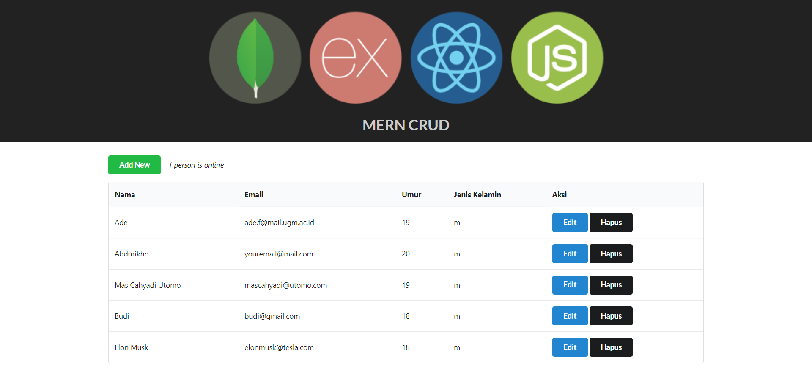

# paw-mern-crud

A simple CRUD web applications with MERN stack and Socket.io.

Demo: [https://paw-mern-crud.herokuapp.com/](https://paw-mern-crud.herokuapp.com/)



## Instructions

For the **back-end**, install the dependencies once via the terminal.
```bash
npm install
```

Run the *main server*. It listens on port 3000.
```bash
npm start
```
View it on the browser.

<br>

If you want to configure the **front-end**, go to *react-src* folder via the terminal.

```bash
cd react-src
```

Install the dependencies required by React once.
```bash
npm install
```

Run the *development server* for React. It listens on port 4200.
```bash
REACT_APP_API_URL=http://localhost:3000 npm start
```

To make a production build, simply run on *react-src* folder via the terminal.
```bash
npm run build
```
